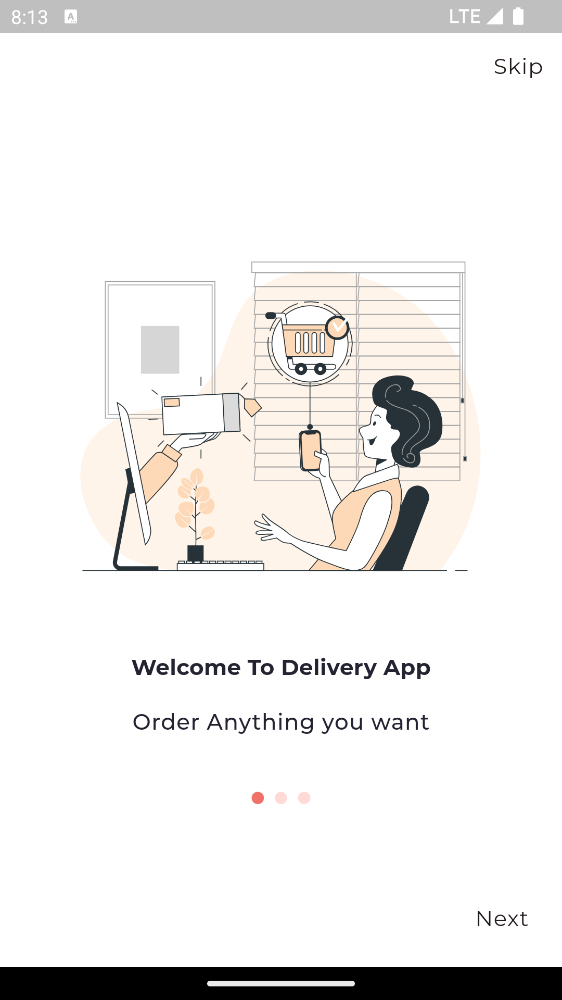
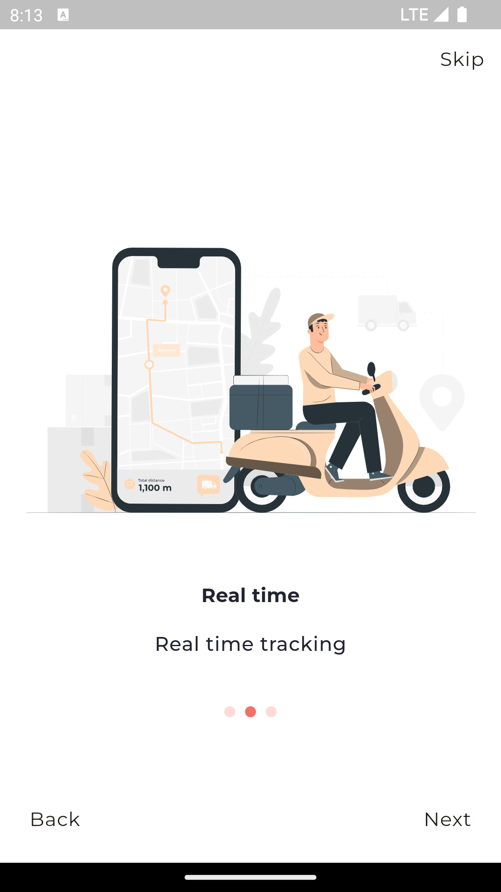
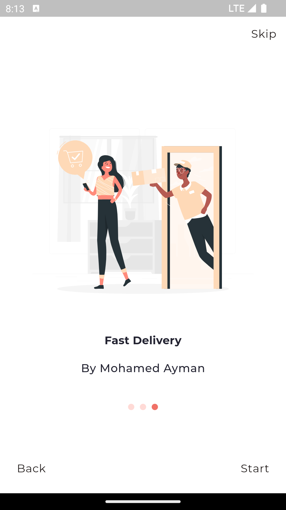
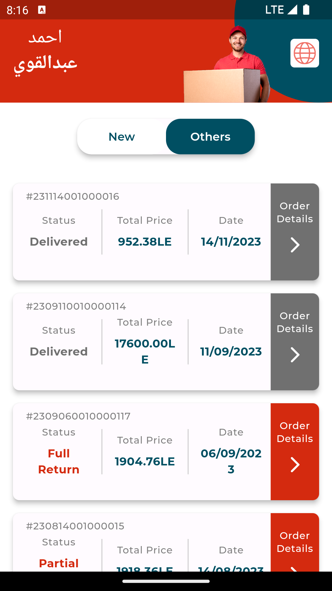

# Delivery App with Flutter

A simple Delivery app built using Flutter that helps you manage your tasks efficiently.

## Screens

- Native Splash Screen
- Flutter Splash Screen
- Onboard Screens.
- Login Screen
- Orders Screen.

## Screenshots








## Getting Started

Follow these instructions to get the project up and running on your local machine.

### Prerequisites

- Flutter SDK
- Android/iOS Emulator or Physical Device

### Installation

1. Clone the repository:

   ```bash
   git clone https://github.com/MohamedAymanMohamedIbrahimEl-Adawy/delivery_app_public.git
   ```

2. Navigate to the project directory:

   ```bash
   cd delivery_app_public
   ```

3. Install the dependencies:

   ```bash
   flutter pub get
   ```

4. Run the app:

   ```bash
   flutter run
   ```

## Dependencies

The app uses the following packages:

- `cupertino_icons: ^1.0.6`
- `flutter_screenutil: ^5.9.0`
- `responsive_framework: ^1.4.0`
- `provider: ^6.1.2`
- `dio: ^5.4.3+1`
- `firebase_core: ^2.30.0`
- `firebase_messaging: ^14.8.2`
- `flutter_local_notifications: ^17.0.1`
- `uni_links: ^0.5.1`
- `easy_localization: ^3.0.5`
- `animations: ^2.0.11`
- `get_it: ^7.6.8`
- `fluttertoast: ^8.2.5`
- `flutter_svg: ^2.0.10+1`
- `cached_network_image: ^3.3.1`
- `flutter_spinkit: ^5.2.0`
- `font_awesome_flutter: ^10.7.0`
- `share_plus: ^8.0.3`
- `shared_preferences: ^2.2.3`
- `adaptive_theme: ^3.6.0`
- `photo_view: ^0.14.0`
- `connectivity_plus: ^6.0.2`
- `flutter_rating_bar: ^4.0.1`
- `animated_notch_bottom_bar: ^1.0.2`
- `smooth_page_indicator: ^1.1.0`
- `another_flushbar: ^1.12.30`
- `path_provider: ^2.1.3`
- `carousel_slider: ^4.2.1`


## Dev Dependencies

The app uses the following packages:

- `flutter_lints: ^3.0.0`
- `flutter_launcher_icons: ^0.12.0`
- `flutter_native_splash: ^2.4.0`

Make sure to add these dependencies to your `pubspec.yaml` file before running the app.
